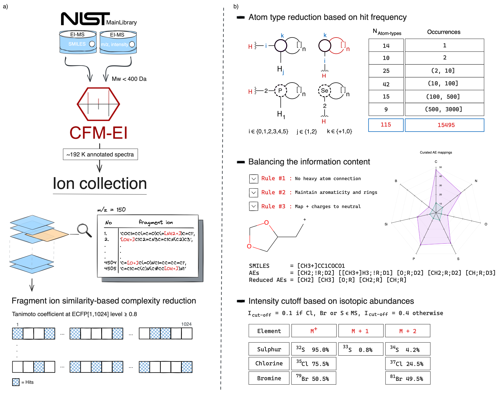
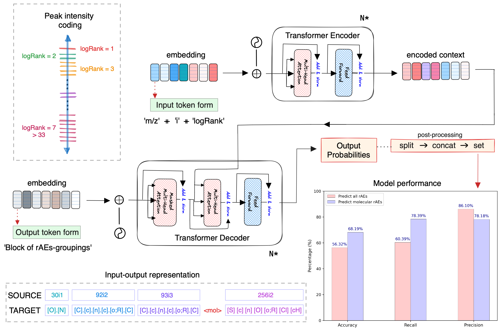

[](https://creativecommons.org/licenses/by-nc/4.0/)

## Refining EI-MS library search results through atomic-level insights
> Ucak U.V., Ashyrmamatov I., Lee J. Preprint ChemRxiv: [10.26434/chemrxiv-2024-vrqzf-v2](https://doi.org/10.26434/chemrxiv-2024-vrqzf-v2)

The inherent complexity of mass spectra and the lack of direct correlation between spectral and structural similarities retards structure elucidation and accurate peak annotation. Our methodology employs modified atomic environments from topological radii zero to represent collections of annotated spectral peaks. Rather than aiming for de novo structure prediction from spectra, our objective is to refine and re-rank candidate structures retrieved by existing library search methods using predicted atom environments. We conducted a multi-step complexity reduction to mass-to-fragment mappings and trained the Transformer model to predict the atomic environments of compounds directly from mass and intensity data, achieving a peak precision of 86.1\% and a recall rate of 78.4\% on the test set. This novel framework not only aids in interpreting EI-MS data by providing insights into structural contents but also refines cosine similarity rankings by suggesting the inclusion or exclusion of certain atomic environments. Our findings over the NIST database suggest that our approach complements conventional methods by improving spectra matching through an in-depth atomic-level analysis.

<!--  -->


<!--  -->


<hr style="background: transparent; border: 0.2px dashed;"/>

## 📋 Requirements

- Python 3.8+
- PyTorch
- SentencePiece
- NumPy
- Rich (for formatted output)

**Install dependencies:**
```bash
pip install -r requirements.txt
```

## 🚀 Quick Start

### Basic Usage
```bash
python predict.py --spectrum_file your_spectrum.txt --output results.json
```

### Input Format
The input file should contain mass/intensity pairs, one per line:

```txt
# Example: spectrum.txt
41    120
43    85
57    450
71    320
85    180
```

- **First column:** m/z value (mass-to-charge ratio)  
- **Second column:** Intensity (absolute or relative)  
- **Separator:** Tab or space

### Preprocessing Options
If your spectrum needs preprocessing (noise removal, normalization):

```bash
python predict.py --spectrum_file raw_spectrum.txt --preprocess --output results.json
```

The `--preprocess` flag will:
- Remove peaks below **0.4%** relative intensity  
- Normalize intensities  
- Convert to **logarithmic ranks (1–7 scale)**

---

## 📊 Understanding the Output

### Console Output (Human-Readable)
The tool displays a formatted table with:
- **Atom-Type:** The predicted atomic environment  
- **Confidence:** Visual confidence bar (normalized `count / max_count`)  
- **Score:** Percentage confidence score  
- **Count:** Number of peaks supporting this prediction  
- **Description:** Human-readable explanation  

**Example output:**
```
═════════════════════════════════════════════════════════════════
                    MassSpec-RefAIner Results
═════════════════════════════════════════════════════════════════

╭───────────────────────────────╮
│ 📊 Spectrum Analysis Summary: │
│    Input peaks: 22            │
│    Processed peaks: 22        │
│                               │
╰───────────────────────────────╯

🔬 Predicted Molecular Atom-Types (rAEs):
   Total unique atom-types: 8

┏━━━━━━━━━━━━━━┳━━━━━━━━━━━━━━━━━┳━━━━━━━━━━┳━━━━━━━━━━┳━━━━━━━━━━━━━━━━━━━━━━━━━━━━━━━━━━━━━┓
┃ Atom-Type    ┃ Confidence      ┃    Score ┃    Count ┃ Description                         ┃
┡━━━━━━━━━━━━━━╇━━━━━━━━━━━━━━━━━╇━━━━━━━━━━╇━━━━━━━━━━╇━━━━━━━━━━━━━━━━━━━━━━━━━━━━━━━━━━━━━┩
│ [C]          │ ██████████      │   100.0% │       27 │ Quaternary carbon (>C<)             │
│ [O]          │ █████░░░░░      │    51.9% │       14 │ Oxygen (ether/carbonyl)             │
│ [F]          │ █████░░░░░      │    51.9% │       14 │ Fluorine                            │
│ [CH2]        │ █░░░░░░░░░      │    18.5% │        5 │ Methylene group (-CH2-)             │
│ [N]          │ ░░░░░░░░░░      │     7.4% │        2 │ Tertiary amine (>N-)                │
│ [CH3]        │ ░░░░░░░░░░      │     3.7% │        1 │ Methyl group (-CH3)                 │
│ [c]          │ ░░░░░░░░░░      │     3.7% │        1 │ Aromatic carbon                     │
│ [cH]         │ ░░░░░░░░░░      │     3.7% │        1 │ Aromatic CH                         │
└──────────────┴─────────────────┴──────────┴──────────┴─────────────────────────────────────┘
```

### 💡 Library Search Refinement Suggestions
- ⚠ Verify presence of: `[O]`, `[F]`, `[CH2]` (moderate confidence)
- ? Low confidence for: `[N]`, `[CH3]`, `[c]`, `[cH]` (may be artifacts)

