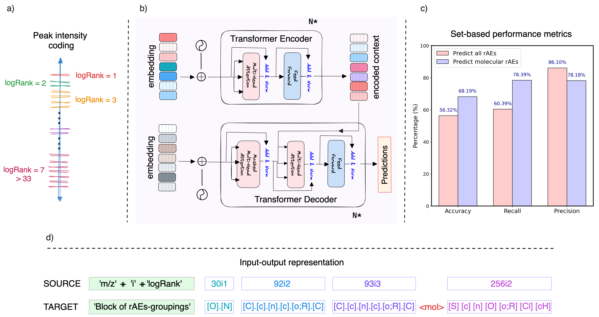

[](https://creativecommons.org/licenses/by-nc/4.0/)

## Refining EI-MS library search results through atomic-level insights
> Ucak U.V., Ashyrmamatov I., Lee J. Preprint ChemRxiv: [10.26434/chemrxiv-2024-vrqzf-v2](https://doi.org/10.26434/chemrxiv-2024-vrqzf-v2)

Mass spectral reference libraries are fundamental tools for compound identification in electron-ionization mass spectrometry (EI-MS). 
However, the inherent complexity of mass spectra and the lack of direct correlation between spectral and structural similarities present significant challenges in structure elucidation and accurate peak annotation. 
To address these challenges, we have introduced an approach combining CFM-EI, a fragmentation likelihood modeling tool in EI-MS data, with a multi-step complexity reduction strategy for mass-to-fragment mapping. 
Our methodology involves employing modified atomic environments to represent fragments of super small organic molecules and training a transformer model to predict the structural content of compounds based on mass and intensity data. 
This holistic solution not only aids in interpreting EI-MS data by providing insights into atom types but also refines cosine similarity rankings by suggesting inclusion or exclusion of specific atom types.
Tests conducted on EI-MS data from the NIST database demonstrated that our approach complements conventional methods by improving spectra matching through an in-depth atomic-level analysis.

<!--  -->

Fragmentation and multi-step complexity reduction plan for EI-MS data interpretation (a) Schematic representation of the data processing workflow, beginning with EI-MS data selection from the NIST Main Library, focusing on compounds with Mw $\leq$ 400 Da, followed by fragment annotation using CFM-EI, and subsequent ion collection. The bottom panel illustrates the initial reduction applied to the pool of fragment ions via similarity thresholding using the Tanimoto coefficient at ECFP2 level. (b) Frequency-based data filtering with respect to atom types (depicted as SMARTS), followed by the process of customizing atomic environment representations to suit analytical needs. The spider chart and adjacent table detail the modifications to AE mappings and the criteria for isotopic abundance-based intensity cutoffs, essential for elements such as S, Cl, and Br.

<!--  -->

Schematic of the transformer model for converting EI-MS spectral data into structural information. Peak intensities are encoded as logRanks and combined with m/z values as inputs to the transformer encoder. The decoder then predicts structural content of fragment ions and molecular content as reduced atomic environments (rAEs). The histogram displays the model's accuracy, recall, and precision metrics.

<hr style="background: transparent; border: 0.2px dashed;"/>

## 📋 Requirements

- Python 3.8+
- PyTorch
- SentencePiece
- NumPy
- Rich (for formatted output)

**Install dependencies:**
```bash
pip install -r requirements.txt
```

## 🚀 Quick Start

### Basic Usage
```bash
python predict.py --spectrum_file your_spectrum.txt --output results.json
```

### Input Format
The input file should contain mass/intensity pairs, one per line:

```txt
# Example: spectrum.txt
41    120
43    85
57    450
71    320
85    180
```

- **First column:** m/z value (mass-to-charge ratio)  
- **Second column:** Intensity (absolute or relative)  
- **Separator:** Tab or space

### Preprocessing Options
If your spectrum needs preprocessing (noise removal, normalization):

```bash
python predict.py --spectrum_file raw_spectrum.txt --preprocess --output results.json
```

The `--preprocess` flag will:
- Remove peaks below **0.4%** relative intensity  
- Normalize intensities  
- Convert to **logarithmic ranks (1–7 scale)**

---

## 📊 Understanding the Output

### Console Output (Human-Readable)
The tool displays a formatted table with:
- **Atom-Type:** The predicted atomic environment  
- **Confidence:** Visual confidence bar (normalized `count / max_count`)  
- **Score:** Percentage confidence score  
- **Count:** Number of peaks supporting this prediction  
- **Description:** Human-readable explanation  

**Example output:**
```
═══════════════════════════════════════════════════════════════
                    MASSSPEC-REFAINER RESULTS                    
═══════════════════════════════════════════════════════════════

📊 Spectrum Analysis Summary:
   Input peaks: 89
   Processed peaks: 89

🔬 Predicted Molecular Atom-Types (rAEs):
   Total unique atom-types: 8

   Atom-Type    Confidence   Score   Count   Description
   ─────────────────────────────────────────────────────────────
   [O]          ███████░░░   72.5%    57     Oxygen (ether/carbonyl)
   [C]          ██████░░░░   65.0%    51     Quaternary carbon (>C<)
   [CH2]        █████░░░░░   55.0%    44     Methylene group (-CH2-)
   [Cl]         █████░░░░░   50.0%    40     Chlorine
   [F]          ████░░░░░░   35.0%    28     Fluorine
   [NH]         ██░░░░░░░░   20.0%    16     Secondary amine (>NH)
   [c]          ██░░░░░░░░   12.5%    10     Aromatic carbon
   [cH]         ██░░░░░░░░   12.5%    10     Aromatic CH
```

### 💡 Library Search Refinement Suggestions
- ✓ Consider **INCLUDING** compounds with: `[O]`, `[C]`, `[CH2]`, `[Cl]`  
- ⚠ **Verify presence** of: `[F]`, `[NH]` (moderate confidence)  
- ? **Low confidence** for: `[c]`, `[cH]` (may be artifacts)

